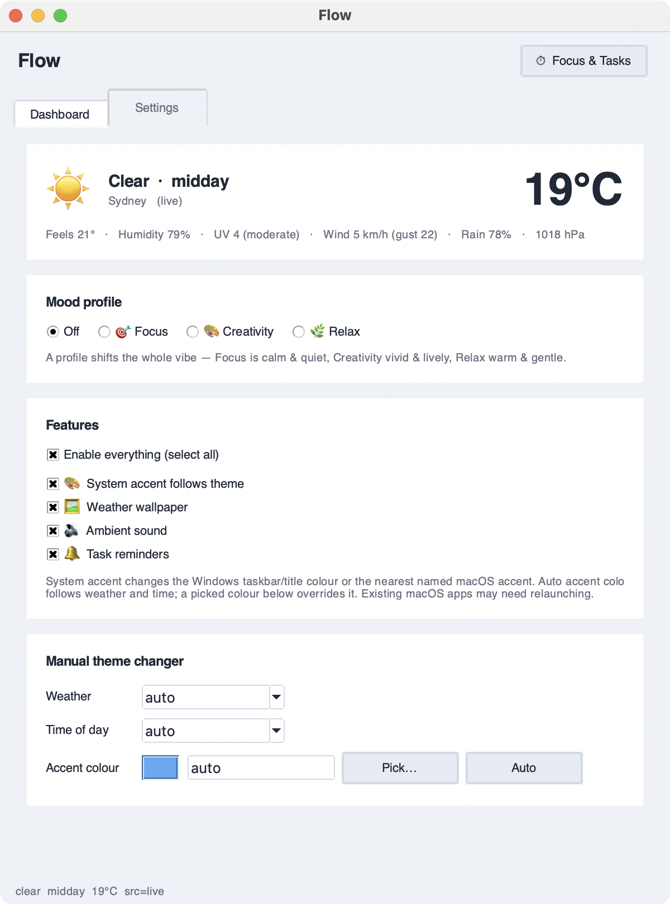
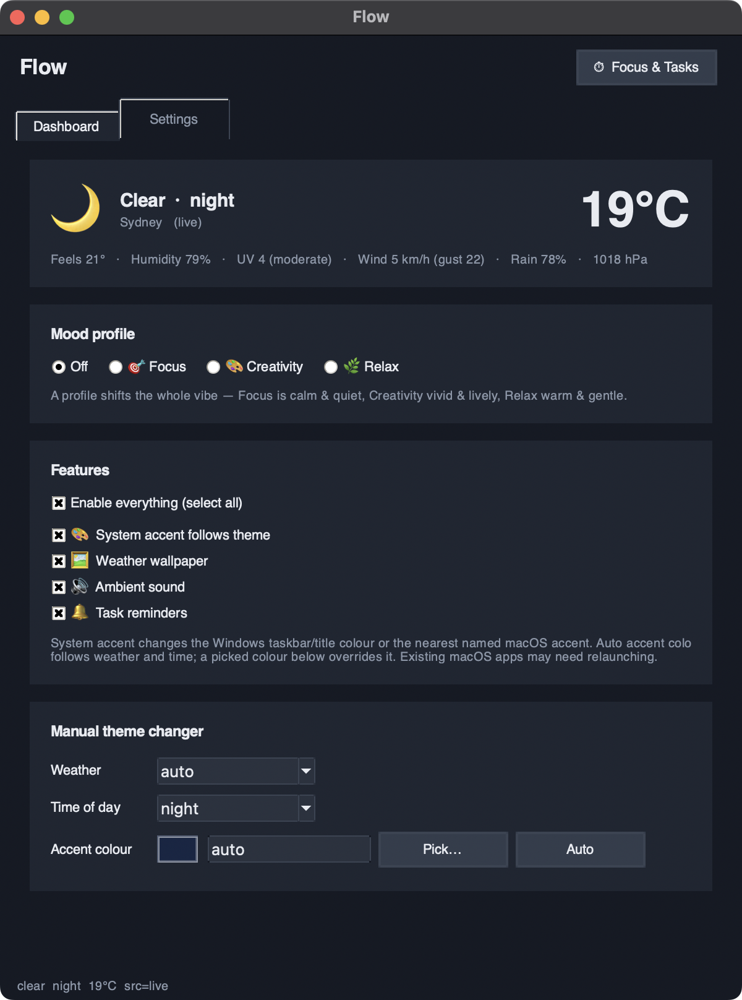
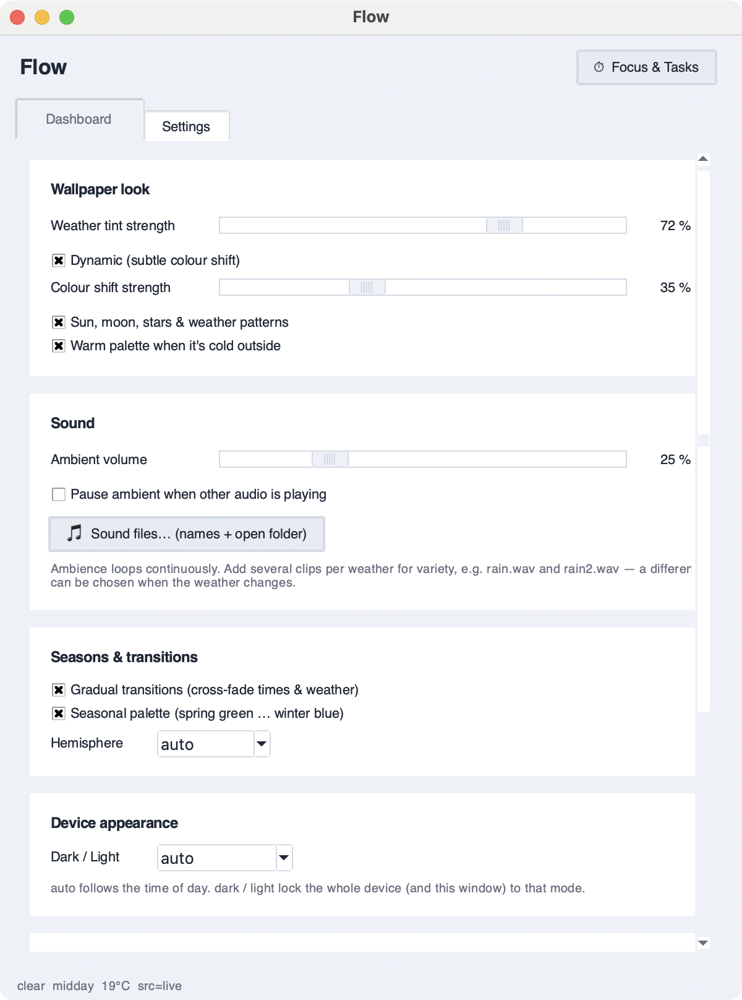
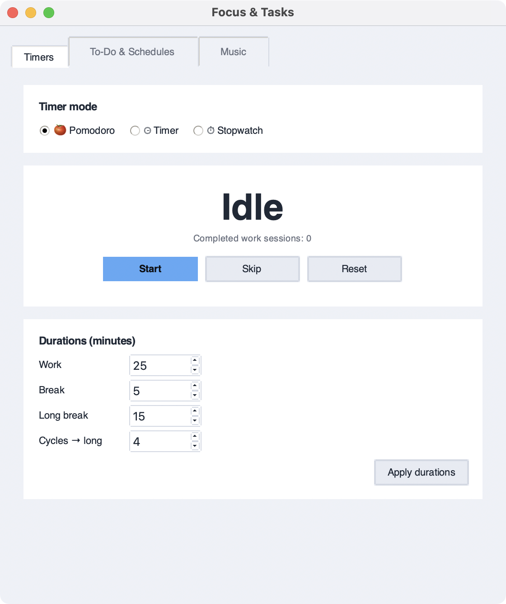
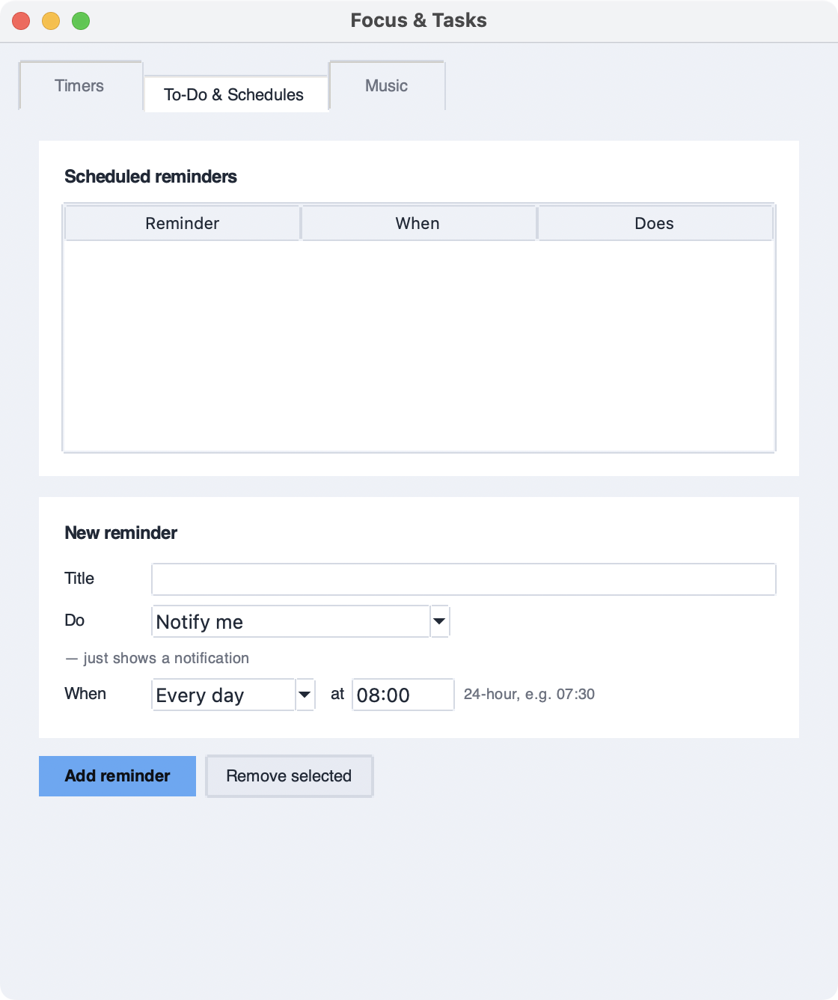
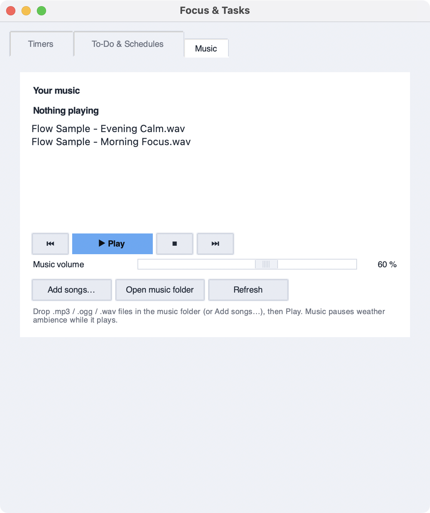

# Flow

Flow is a desktop app for macOS and Windows that makes your computer match the
weather and time of day outside. It changes your accent colour and desktop
wallpaper, plays quiet ambient sound, and comes with a Pomodoro timer and task
reminders. There's also a countdown timer, a stopwatch and a local music player.

It doesn't need much to run. Weather and audio are optional, and the wallpaper
images are drawn with the Python standard library.

Flow's main features (timed breaks, ambient sound, music, colour and light, and
reminders) are based on published research into focus and productivity. See
[The research behind Flow](#the-research-behind-flow) for the studies.

---

## Screenshots

| Dashboard (day) | Dashboard (night) |
|---|---|
|  |  |

| Settings | Timers |
|---|---|
|  |  |

| To-Do & Schedules | Music |
|---|---|
|  |  |

---

## Getting Flow

There are three ways to run Flow. Most people should use the first.

### 1. Download the app (no Python or command line needed)

Grab the latest build from the
**[Releases page](https://github.com/CardBoardFlakes/EnterpriseTerm3Project/releases/latest)**:

| Your computer | Download | Install |
|---|---|---|
| Mac with Apple silicon (M1 or newer) | `Flow-macOS-arm64.dmg` | Open the DMG and drag **Flow** into **Applications**. |
| Mac with an Intel processor | `Flow-macOS-x86_64.dmg` | Same as above. |
| Windows 10 / 11 | `Flow-Windows-x64.exe` | Save it anywhere (e.g. your Desktop) and double-click it. Nothing to install. |

Then open Flow like any other app: from Launchpad or the Applications folder on
macOS, or by double-clicking `Flow-Windows-x64.exe` on Windows.

> **First launch security prompts.** The builds aren't code-signed, so the first
> time you open Flow your OS will ask you to confirm:
> - **macOS:** if you see *"Flow can't be opened"* or *"Apple could not verify…"*,
>   open **System Settings → Privacy & Security**, scroll down and click
>   **Open Anyway** next to Flow (on older macOS: right-click Flow → **Open**).
>   macOS may also ask whether Flow can control *System Events*. Say yes,
>   otherwise Flow can't change your accent colour, Dark/Light mode or wallpaper.
> - **Windows:** if SmartScreen shows *"Windows protected your PC"*, click
>   **More info → Run anyway**.

The downloaded app keeps its settings in `~/Library/Application Support/Flow/`
(macOS) or `%APPDATA%\Flow\` (Windows). **Run at login** (Settings → Engine)
works with the downloaded app too, and starts it in the background.

### 2. Run from source

```bash
git clone https://github.com/CardBoardFlakes/EnterpriseTerm3Project.git
cd EnterpriseTerm3Project
pip install -r requirements.txt      # optional deps: requests (weather), pygame (sound)
python main.py                       # launch the GUI
```

The engine starts with the window, and settings are saved and applied as soon
as you change them.

> **GUI won't open?** `tkinter` ships with Python but isn't a pip package.
> - macOS (Homebrew): `brew install python-tk` (match your Python version)
> - Debian/Ubuntu: `sudo apt install python3-tk`
> - Windows: included with the python.org installer

The full walkthrough is in **[docs/USER_GUIDE.md](docs/USER_GUIDE.md)**.

### 3. Build the app yourself

Builds use [PyInstaller](https://pyinstaller.org/). You have to build on the OS
you're targeting, so a Mac builds the Mac app and Windows builds the `.exe`:

```bash
pip install -r requirements.txt -r packaging/requirements-build.txt
python packaging/build.py
```

| OS | Output in `dist/` |
|---|---|
| macOS | `Flow.app` and `Flow-macOS-<arch>.dmg` |
| Windows | `Flow.exe` (single file, no console window) and `Flow-Windows-<arch>.exe` |

To publish a release, push a version tag. GitHub Actions
([`.github/workflows/release.yml`](.github/workflows/release.yml)) then runs the
tests, builds the Apple-silicon Mac, Intel Mac and Windows apps, and attaches
them to a new GitHub Release:

```bash
git tag v1.0.0
git push origin v1.0.0
```

If you just want the builds without publishing anything, run the workflow by
hand from the **Actions** tab ("Build desktop apps" → *Run workflow*) and
download them as artifacts.

---

## What it does

| Feature | Summary |
|---|---|
| **System accent follows theme** | OS accent colour follows the weather and time unless you pick a manual colour. On Windows that's the taskbar and title-bar accent. macOS snaps to the nearest named accent, and apps that are already open may need relaunching. |
| **Time-of-day light** | Theme and wallpaper follow the day's light through sunrise, morning, midday, afternoon, sunset, dusk and night. They're warm and low at either end of the day, bright and neutral at noon, and deep blue at night. |
| **Gradual transitions** | Time-of-day colour shifts continuously and weather changes cross-fade over a few seconds, so nothing jumps. |
| **Seasons** | A seasonal wash nudges the palette (fresh-green spring → golden summer → amber autumn → cool-blue winter). The hemisphere is worked out from your latitude. |
| **Mood profiles** | **Focus**, **Creativity** and **Relax** profiles change the colours and sound. Pick "None" to turn them off. |
| **Multi-monitor** | Sets the wallpaper on every connected display (toggleable). |
| **Accessibility** | A **high-contrast** mode forces bold, maximum-contrast colours and a black/white/yellow window. |
| **Dark/Light lock** | Force the device (and app) to Dark or Light, or let it follow the time of day. |
| **Weather wallpaper** | A sky-gradient background per condition, with weather patterns (rain, sun, clouds, stars) and a cosy warm tint when it's cold. |
| **Independent features** | **Enable everything** turns all features on or off at once. You can also leave it off and pick accent, wallpaper, ambience or reminders one at a time. |
| **Ambient sound** | Weather and time-of-day soundscapes loop while Flow is open and stop when you close its last window. You can add your own files or variants. Windy skies use the cloudy ambience. |
| **Music player** | Two original sample tracks appear automatically in an empty library. Add your own songs (mp3/ogg/wav/flac/m4a), with playlist controls and a separate volume. |
| **Audio priority** | Playing Flow's music always pauses the ambience, which comes back when the music stops. An optional setting also pauses ambience when another app plays audio (CoreAudio on macOS, `pycaw` on Windows). Flow's own processes don't count. |
| **Timers** | A Timers tab with three modes: **Pomodoro** (work/break cycles), a plain **countdown Timer**, and a **Stopwatch** with laps. |
| **Tasks & schedules** | Daily or one-off reminders that show a notification or play a chime. |
| **Live weather panel** | Temperature, feels-like, humidity, UV index (with risk band), wind + gusts, rain chance and pressure, refreshed automatically. |
| **Manual overrides** | Force a weather condition, time of day, or exact accent colour. Measurements stay live, and a forced weather label is marked `manual`. Night is a time-of-day choice, not a weather condition. |
| **Time-of-day UI** | The app window uses a light theme by day and a dark theme at night, and picks up the active theme accent when it switches. |
| **Location privacy** | Flow never detects your location. It only sends the coordinates of the city you picked, to get the weather. |
| **Run at login** | Optional auto-start (macOS LaunchAgent / Windows Run key). |

---

## The research behind Flow

Most of Flow's features are based on published research into how breaks,
sound, colour, light, music and planning affect focus and productivity. These
studies tested the general techniques, not Flow itself, and results vary from
person to person. Read the table as the reasoning behind each feature rather
than a promise.

| Feature | What the research found | Study |
|---|---|---|
| **Pomodoro timer** | Students who took planned breaks (a 6-minute break after every 24 minutes, Pomodoro-style) said they felt more focused and motivated, and found tasks less hard, than students who chose their own breaks. These were self-reports, not test scores. | Biwer et al. (2023), *British Journal of Educational Psychology*, [doi:10.1111/bjep.12593](https://doi.org/10.1111/bjep.12593) |
| **Pomodoro timer / reminders** | Attention on a long task fades over time. Short, occasional switches away from the task stopped that decline. | Ariga & Lleras (2011), *Cognition*, [doi:10.1016/j.cognition.2010.12.007](https://doi.org/10.1016/j.cognition.2010.12.007) |
| **Ambient sound** | A moderate level of background noise (about 70 dB, roughly a busy café) boosted creative thinking compared with quiet. Loud noise (85 dB) hurt it, which is why Flow's ambience is quiet by default (25% volume). | Mehta, Zhu & Cheema (2012), *Journal of Consumer Research*, [doi:10.1086/665048](https://doi.org/10.1086/665048) |
| **Weather / nature soundscapes** | A review of the research found that natural sounds such as water, wind and birdsong lowered stress and annoyance and improved mood and health. | Buxton et al. (2021), *PNAS*, [doi:10.1073/pnas.2013097118](https://doi.org/10.1073/pnas.2013097118) |
| **Music player** | Software developers who listened to music they liked at work had better mood and higher quality of work. Time-on-task was longest with no music. | Lesiuk (2005), *Psychology of Music*, [doi:10.1177/0305735605050650](https://doi.org/10.1177/0305735605050650) |
| **Colour themes** | The colour around you can change how you approach a task. In this study, red helped with detail-oriented tasks and blue helped with creative ones. Colour research is mixed, and part of this effect [failed to replicate](https://pubmed.ncbi.nlm.nih.gov/24222366/). Flow uses colour to set a mood, not as a proven performance boost. | Mehta & Zhu (2009), *Science*, [doi:10.1126/science.1169144](https://doi.org/10.1126/science.1169144) |
| **Bright, cool daytime theme** | Office workers under blue-enriched white light during the day reported better alertness, performance and concentration, and less evening fatigue. | Viola et al. (2008), *Scand. J. Work, Environment & Health*, [doi:10.5271/sjweh.1268](https://doi.org/10.5271/sjweh.1268) |
| **Warm, dark evening theme** | Bright light from screens before bed made it harder to fall asleep, delayed the body clock and lowered next-morning alertness. That's why Flow goes warm and dark at dusk and night. | Chang et al. (2015), *PNAS*, [doi:10.1073/pnas.1418490112](https://doi.org/10.1073/pnas.1418490112) |
| **Tasks & schedules** | A review of 94 tests found that concrete "when X happens, I'll do Y" plans help people reach their goals much more than good intentions alone. Timed reminders put this into practice. | Gollwitzer & Sheeran (2006), *Advances in Experimental Social Psychology*, [doi:10.1016/S0065-2601(06)38002-1](https://doi.org/10.1016/S0065-2601(06)38002-1) |

---

## Documentation

There's a guide for each part of the app in **[`docs/`](docs/)**:

| Guide | What's inside |
|---|---|
| [User guide](docs/USER_GUIDE.md) | First launch, the Dashboard & Settings tabs, the Focus & Tasks window, and running at login. |
| [Wallpaper guide](docs/WALLPAPER.md) | Generated PNG wallpapers: weather patterns, sun/moon movement, subtle drift, and cold-weather warmth. |
| [Sound guide](docs/SOUNDS.md) | Built-in ambience, custom clips and variants, audio priority, and local music. |
| [Tasks & timers guide](docs/TASKS_AND_TIMER.md) | Pomodoro, countdown, stopwatch, and daily / one-off reminders. |
| [Configuration reference](docs/CONFIGURATION.md) | Every `config.json` key, defaults, and where files are stored. |
| [Troubleshooting](docs/TROUBLESHOOTING.md) | GUI, audio, wallpaper, accent-colour, and weather issues. |

---

## Running modes

```bash
python main.py              # settings GUI (default)
python main.py --once       # run one engine cycle, then exit
python main.py --background # headless loop (what "run at login" launches)
python tests.py             # run the test suite
```

The downloaded app takes the same flags, for example
`/Applications/Flow.app/Contents/MacOS/Flow --once` or
`Flow-Windows-x64.exe --background`.

You can run the GUI and background mode at the same time. They share one
engine, so opening the settings window won't double up or silence the ambient
sound, and changes you make in the window still apply straight away. The window
also repaints itself, so profile, manual theme, Dark/Light, seasonal and
high-contrast changes show up immediately even when the background process is
the one running the engine.

---

## Location & privacy

The app **does not detect your location**. There's no GPS, no IP lookup, no OS
query and no "auto-detect". It uses fixed coordinates for the city you picked:

1. A hardcoded default in `config.py`: `{"lat": -33.8688, "lon": 151.2093,
   "name": "Sydney"}`.
2. The **City** dropdown in Settings → Engine replaces that default with a
   city from the built-in list and saves it to `config.json`.
3. For an unlisted city, you can edit the `location` block in `config.json`.
4. Those `lat`/`lon` are placed directly in the Open-Meteo request URL
   (`…?latitude=<lat>&longitude=<lon>&…&timezone=auto`). `timezone=auto` just
   returns times in that coordinate's timezone. It doesn't locate you.

So until you pick another city, Flow fetches weather for **Sydney**, wherever
your computer actually is. For custom coordinates, see the
[Configuration reference](docs/CONFIGURATION.md#location).

The only thing that leaves your machine is the configured `lat`/`lon`, sent to
Open-Meteo over HTTPS about once every 10 minutes. There's no API key or account.
Everything else stays local. Settings and reminders are plaintext JSON, and
audio and generated wallpapers are ordinary local files. There is no telemetry
or analytics. Coordinates still count as low-sensitivity **personal** data, so
if you're entering your own, use a nearby town rather than your exact address.

---

## Project layout

| File | Responsibility |
|---|---|
| `main.py` | Entry point (GUI / `--once` / `--background`) |
| `gui.py` | Tkinter UI: Dashboard + Settings tabs, separate Focus & Tasks window |
| `engine.py` | Stateful orchestration: cheap steps, work only on change |
| `config.py` | Defaults, load/save, feature gating |
| `weather.py` | Live weather (Open-Meteo) + manual override + offline fallback |
| `theme.py` | Compute colour + apply accent (Windows / macOS) |
| `wallpaper.py` | Generate + set the weather wallpaper (patterns, warmth, drift) |
| `profiles.py` | Focus / Creativity / Relax mood profiles (colour + settings overlay) |
| `sound.py` | Ambient sound selection, variants, playback, placeholder synth |
| `music.py` | Background music player, which creates starter samples for an empty library |
| `audiocheck.py` | Best-effort detection of audio from other apps (for auto-duck) |
| `pomodoro.py` | Pomodoro timer state machine |
| `clocks.py` | Stopwatch and countdown timer state machines |
| `tasks.py` | Tasks & schedules store |
| `activity.py` | Idle-time detection |
| `autostart.py` | Run-at-login (LaunchAgent / Run key) |
| `processlock.py` | Single-engine and cross-process audio ownership |
| `paths.py` | Where data lives (project folder from source, per-user folder when packaged) |
| `packaging/` | PyInstaller spec, icon generator and `build.py` for the desktop apps |
| `.github/workflows/release.yml` | Builds + publishes the macOS / Windows apps on version tags |

Settings go in `config.json` and tasks in `tasks.json`. From source they sit in
the project folder, and the downloaded app keeps them in its per-user data
folder. Generated wallpaper assets go in `~/.environment_theme_controller/`.

---

## Testing

```bash
python tests.py
```

The suite runs 463 headless checks. They cover config, mood profiles, seasons,
gradual transitions and easing, high-contrast mode, weather overrides, theme and
time-of-day phases, and the wallpaper code (PNG output, drift, patterns, warmth
and reliably restoring your original wallpaper). They also test sound selection,
variants and continuous-loop recovery, starter music generation, tasks,
autostart, packaged-app data paths, all three timer modes, the GUI value mapping
and display helpers (icons, temperature, UV band, live-data line), idle
detection, other-audio detection, desktop notifications, and the engine's pure
helpers and change-guards. Every call that would change your system (accent,
wallpaper, audio, notifications, launchctl/registry) is stubbed out, so running
the tests never touches your machine.

### Linting

Code is linted with [Ruff](https://docs.astral.sh/ruff/) (config in `ruff.toml`):

```bash
pip install ruff
python3 -m ruff check .      # 0 issues
```
